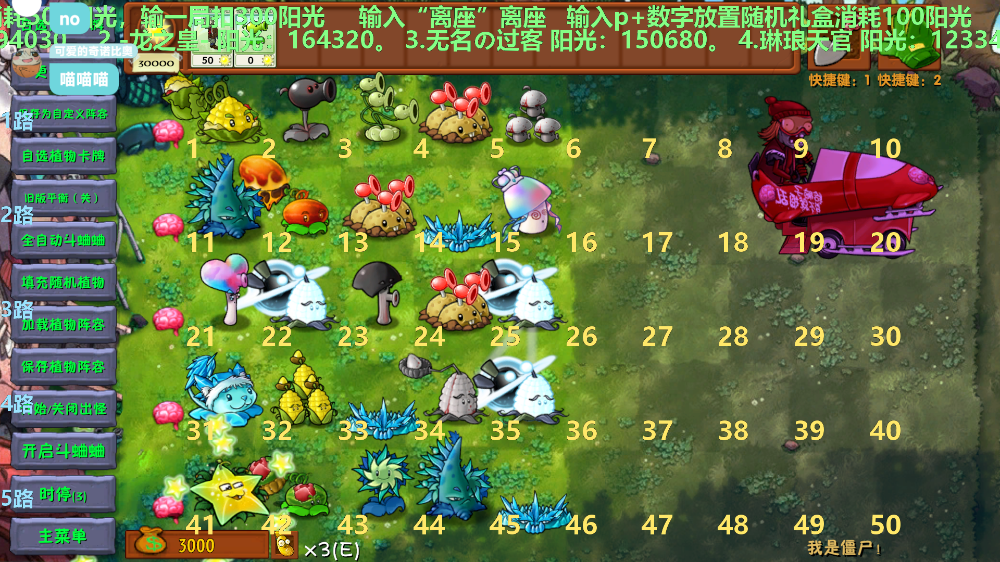

# PVZRH_BLIVE  
✏️与PVZ融合版结合，专为bilibili直播打造的弹幕互动玩法🥳  
😜想要查看效果，关注直播间：http://live.bilibili.com/4638098  
放一张直播图：

### 功能介绍
- 可实现功能：修改阳光，修改放置的植物id，放置植物/僵尸，铲除、更换植物，入座系统，阳光存储系统，签到系统。
- 实现方式：基于Python、逆向、汇编代码注入。
- 观众游玩功能：入座，放置植物盲盒，赢取阳光，签到领阳光，猜赢领阳光，计划持续添加功能。
- 游戏逆向已实现功能：鼠标点击，键盘点击，鼠标坐标改变，改变植物id，改变僵尸id
### 日志
- 🔥2024/12/13:将代码整体上传到仓库🔥
- 🔥2025/5/28:重构计划开始，删除文件🔥
- 🔥2025/7/4:上传2.5.0版本代码🔥
- 🔥2025/7/27:更新，新增功能和防卡机制🔥
- 🔥2025/8/30:融合版2.8.2跟新🔥

### 前置要求
- b站获取主播身份码，应用id，access_key,access_key_secret. 后三项需要申请开发者入驻
- csrf_token,cookie,和roomid.前两项的教程[点击这里](https://github.com/sixbenzene/PVZRH_BLIVE?tab=readme-ov-file#%E8%8E%B7%E5%8F%96csrf_tokencookie)
- 建议打开obs的websocket功能，防卡机制将调用。
### 如何开始
- 拉取代码
```
git clone https://github.com/sixbenzene/PVZRH_BLIVE.git
cd PVZRH_BLIVE
```
- 创建conda环境
```
conda create -n blive python=3.10
pip install -r requirements.txt
```
在config.py填写需要的参数
- 在[releases](https://github.com/sixbenzene/PVZRH_BLIVE/releases/tag/pvzRH)下载植物大战僵尸v2.8.2压缩包
打开植物大战僵尸，进入我是僵尸模式，开启自动斗蛐蛐
```
python receive_msg_2.8.2.py
```
- 直播使用obs并开启websocket

### 其他注意事项
- 没有在其他人的电脑上测试过，如果有问题联系作者。

### 获取csrf_token,cookie
- 打开自己直播间，按下f12，查看network  
  检索关键字检索send。手动发送一个弹幕。  
  这时会跳出来一个请求，查看这个请求的payload。里面有csrf_token如图
  

- 在headers可以找到cookie如图


## Star History

[](https://star-history.com/#sixbenzene/PVZRH_BLIVE&Date)


